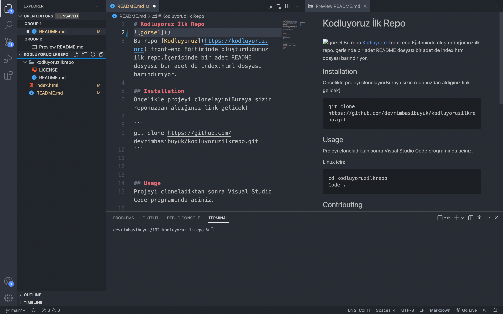

# Kodluyoruz İlk Repo

Bu repo [Kodluyoruz](https://kodluyoruz.org) front-end Eğitiminde oluşturduğumuz ilk repo.İçerisinde bir adet README dosyası bir adet de index.html dosyası barındırıyor.

## Installation
Öncelikle projeyi clonelayın(Buraya sizin reponuzdan aldığınız link gelicek)

```
git clone https://github.com/devrimbasibuyuk/kodluyoruzilkrepo.git
```


## Usage
Projeyi cloneladiktan sonra Visual Studio Code programinda aciniz.

Linux icin:
``` 
cd kodluyoruzilkrepo
Code . 
```


## Contributing

Pull requestler kabul edilir. Büyük degisiklikler icin, lütfen önce neyi degistirmek
istediginizi tartismak için bir konu aciniz.

## License

[MIT]()